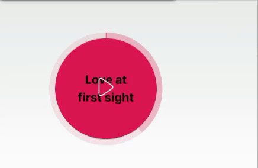

# React Circle Player



## Install

```bash
npm install --save react-circle-player
# OR
yarn add react-circle-player
```

## Usage

You will need to integrate this component with another media player library.

```jsx
import React, { useRef, useState } from 'react'
import ReactPlayer from 'react-player'
import ReactCirclePlayer from 'react-circle-player'
import 'react-circle-player/lib/styles.css'

const Example = () => {
  const player = useRef(null)
  const [playing, setPlaying] = useState(false)
  const [playerState, setPlayerState] = useState({
    played: 0,
    loaded: 0,
  })

  const onSeek = (amount) => {
    if (player.current) {
      player.current.seekTo(amount, 'fraction')
    }
  }

  return (
    <>
      <ReactPlayer
        ref={player}
        url='https://soundcloud.com/bledjon510/doughnuts'
        playing={playing}
        height='0'
        width='0'
        onProgress={setPlayerState}
        onEnded={() => setPlaying(false)}
      />
      <ReactCirclePlayer
        played={playerState.played}
        loaded={playerState.loaded}
        playing={playing}
        onSeek={onSeek}
        onTogglePlaying={() => setPlaying(!playing)}
      />
    </>
  )
}
```

## License

MIT © [Nikita Jaiswal](https://github.com/nikitaJaiswalDev)
